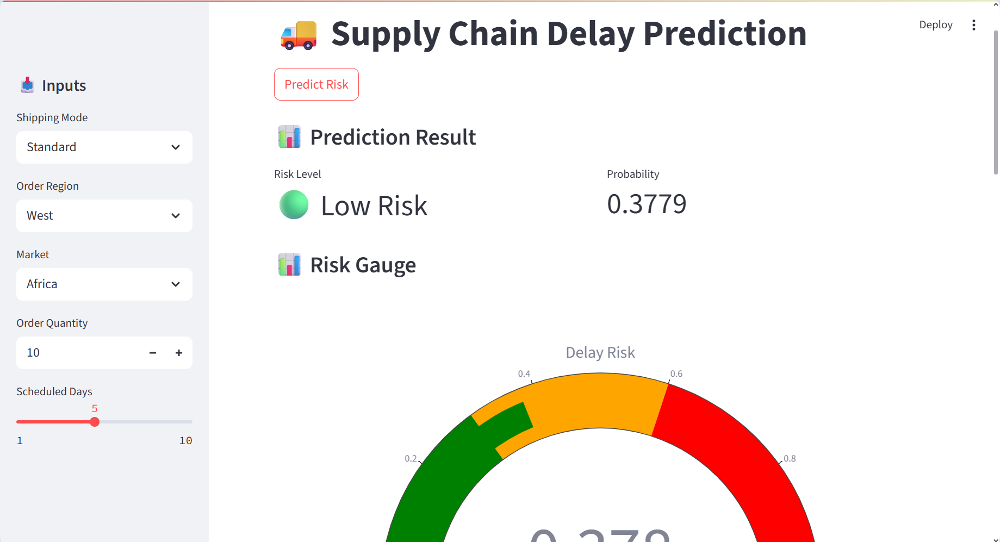

# 🚚 Supply Chain Delay Prediction (ML + Dashboard)
**Live Dashboard:** https://l5mbhjcmdrceihvajl6egq.streamlit.app/

## 📌Overview
This project builds an end-to-end machine learning system to predict the risk of late deliveries in supply chain operations. It helps logistics teams identify high-risk shipments early and take proactive actions.

---

## 🎯 Objectives
- Predict whether an order will be delayed  
- Classify shipments into Low, Medium, and High risk  
- Support data-driven logistics decisions  

---

## 📊Dataset
- ~180,000 records  
- Real-world supply chain dataset  

**Key Features:**
- Shipping Mode  
- Order Quantity  
- Scheduled Delivery Days  
- Region and Market  
- Pricing and Discounts  

---

## 🧠 Machine Learning Approach

**Models Used:**
- Logistic Regression  
- Random Forest  
- XGBoost (Final Model)  

**Techniques:**
- Feature engineering  
- One-hot encoding  
- Data leakage removal  
- Probability calibration  
- Threshold tuning  

---

## 📈Model Performance

| Metric | Value |
|--------|------|
| Accuracy | ~72% |
| Precision (Delay) | ~85% |
| Recall (Delay) | ~59% |

---

## 🚨 Data Leakage Handling
Removed features:
- Days for shipping (real)  
- Delivery Status  

These features directly revealed the outcome and caused unrealistic predictions.

---

## 📊 Dashboard Features
- Real-time delay prediction  
- Risk classification  
- Risk gauge visualization  
- Feature importance  
- What-if analysis  

---

## ⚙️ Tech Stack
- Python  
- Pandas, NumPy  
- Scikit-learn  
- XGBoost  
- Streamlit  
- Plotly  

---

## 📊 Dashboard Preview

---
## 🚀 How to Run

pip install -r requirements.txt  
streamlit run app.py  

---

## 📂Project Structure

project/  
├── app.py  
├── model.pkl  
├── features.pkl  
├── base_input.pkl  
├── requirements.txt  
├── README.md  

---

## 💡Key Insights
- Standard shipping increases delay risk  
- Larger orders increase complexity  
- Short delivery windows increase pressure  
- Region and market affect delivery performance  

---

## Limitations
- Predictions are probabilistic  
- Some features use baseline values  
- Model may miss certain delayed shipments  

---

## 🚀 Future Improvements
- Improve recall  
- Integrate real-time data  
- Deploy on cloud  

---

## 👨‍💻Author
Tejas Hagwane  
https://github.com/tejashagawane
